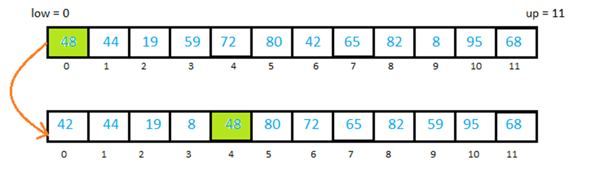
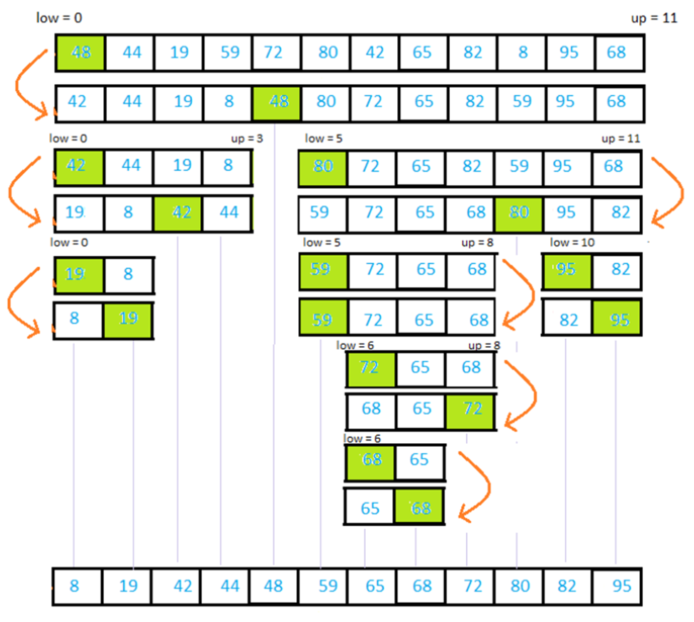

# Quick Sort

## Big O

| Time Complexity(Best) | Time Complexity(Average) | Time Complexity(Worst) | Space Complexity |
| ------------- | ------------- | ------------- | ------------- |
| O(n log n)    | O(n log n)    | O(n^2)    | O(log n)          |

## Explanation 
### O(n log n)
* O(log n) - decompositions ***How much we divide initial array***
* O(n) - comparisons per decomposition ***At the end we have N arrays with one element. And we compare them***
### O(n^2)
* we have this if array already sorted

### Resources
* [bigocheatsheet.com](http://bigocheatsheet.com/)
