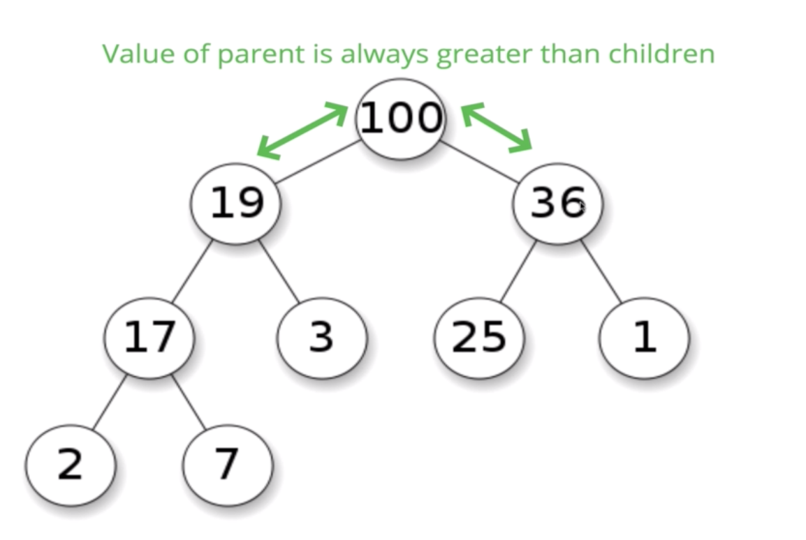
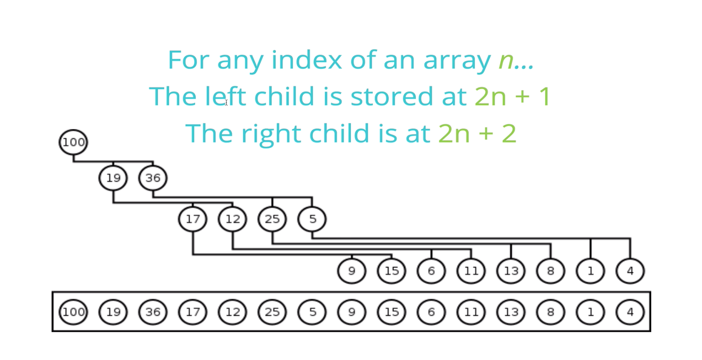
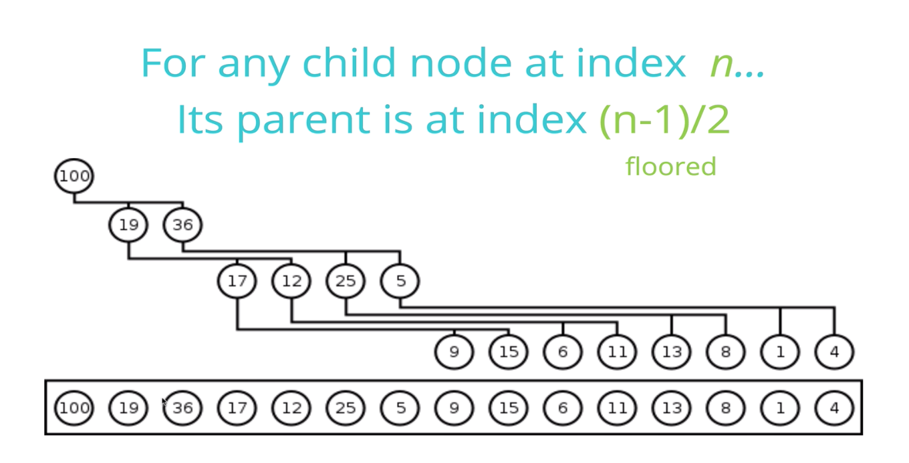
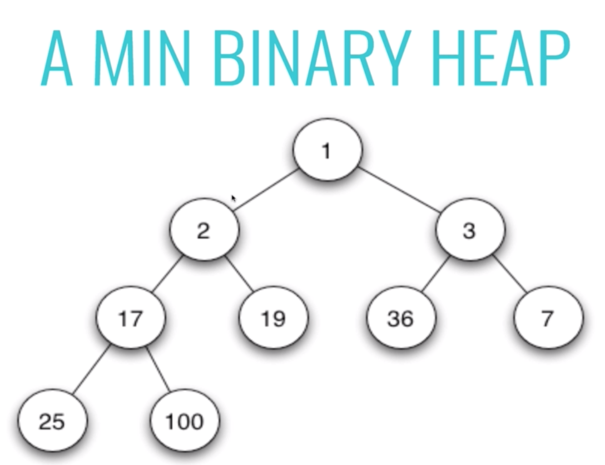

# BINARY HEAP

## What is a binary heap?
* [Binary Heap](https://www.geeksforgeeks.org/binary-heap/)
* **Very** similar to a binary search tree,
but with some different rules
- **MaxBinaryHeap** - parent nodes are always larger than child nodes.

- **MinBinaryHeap** - parent nodes are always smaller than child nodes.

## BIG O
* insertion - O(log N)
* removal - O(log N)
* search - O(N)
