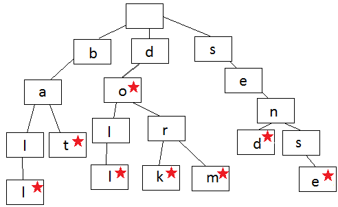

["ball", "bat", "doll", "dork", "dorm", "do", "send", "sense"]


```angular2
myTrie = new Trie();
myTrie.add('ball');
myTrie.add('bat');
myTrie.add('doll');
myTrie.add('dork');
myTrie.add('do');
myTrie.add('dorm');
myTrie.add('send');
myTrie.add('sense');
console.log(myTrie.isWord('doll')); // true
console.log(myTrie.isWord('dor')); // false
console.log(myTrie.isWord('dorf')); // false
console.log(myTrie.print()); // [
                                  'ball', 'bat',
                                  'doll', 'dork',
                                  'dorm', 'do',
                                  'send', 'sense'
                                ]
```
