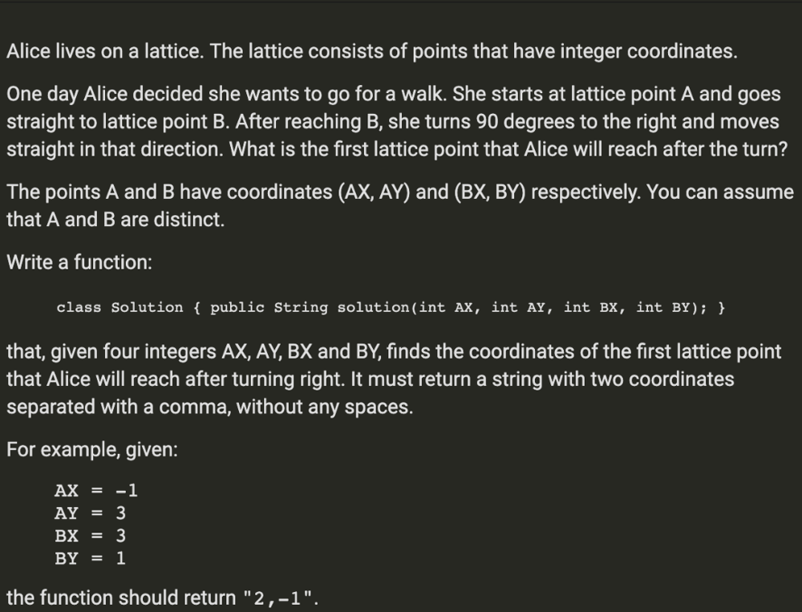
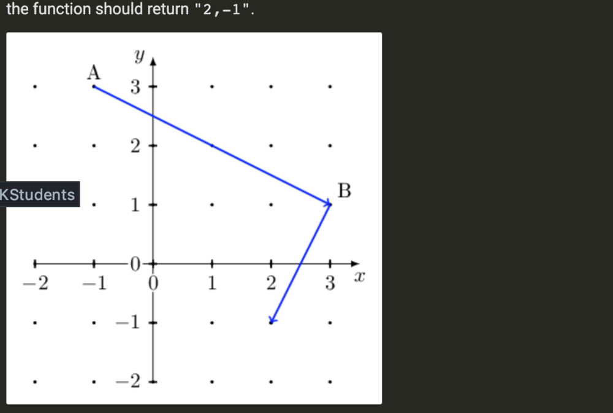

For future readers: This is based on Chixing's solution below. Here is why we do the things that we do. The below are mathematics related points, so don't worry if you didnt get it in the first try :-) It took me hours to figure this out. Hope this helps.

1. The formula to rotate any pair of points (x,y) clockwise about the origin is (y, -x), and counter-clockwise is (-y, x) .
   Here We try to rotate the points relative to the origin (i.e 0, 0), so we get the dx (Bx - Ax) and dy (By - Ay) first , then use above formula to rotate it
   Watch: https://www.youtube.com/watch?v=A19TeoJcGXY
   Read: https://math.stackexchange.com/questions/1330161/how-to-rotate-points-through-90-degree
2. The reason we take the GCD of the (dx, dy) is because we are interested in finding the minimum vector ( from Bx, By) which is still an integer(for it to be on a lattice point). GCD is that
   property we are looking for . If we just take the rotated vector , it might be too long spanning multiple lattice points, so we take GCD of (dx, dy) first, and then divide with rx , ry
   (rotated vector) to get the new vector that hits the first lattice point (a.k.a minimum length)
   Read :https://math.stackexchange.com/questions/1330161/how-to-rotate-points-through-90-degree
3. Since we start walking clockwise from B, we add the values obtained above to Bx, By to get the new co-ordinates

