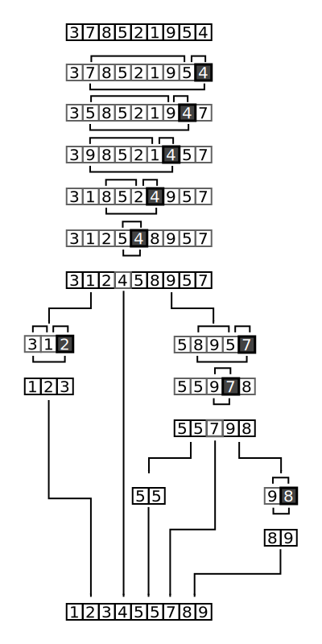

# Quick Sort
[implementation](./index.js)

Full example of quicksort on a random set of numbers. The shaded element is the pivot. It is always chosen as the last element of the partition. However, always choosing the last element in the partition as the pivot in this way results in poor performance (O(n²)) on already sorted arrays, or arrays of identical elements. Since sub-arrays of sorted / identical elements crop up a lot towards the end of a sorting procedure on a large set, versions of the quicksort algorithm that choose the pivot as the middle element run much more quickly than the algorithm described in this diagram on large sets of numbers.

## Big O

| Time Complexity(Best) | Time Complexity(Average) | Time Complexity(Worst) | Space Complexity |
| ------------- | ------------- | ------------- | ------------- |
| O(n log n)    | O(n log n)    | O(n^2)    | O(log n)          |

## Explanation 
### O(n log n)
* O(log n) - decompositions ***How much we divide initial array***
* O(n) - comparisons per decomposition ***At the end we have N arrays with one element. And we compare them***
### O(n^2)
* we have this if array already sorted

### Resources
* [bigocheatsheet.com](http://bigocheatsheet.com/)
